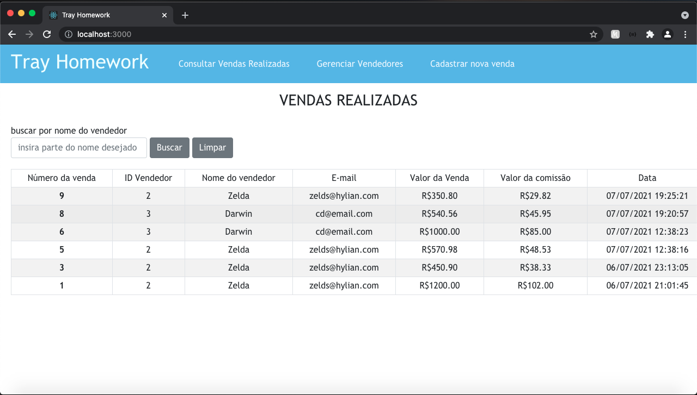
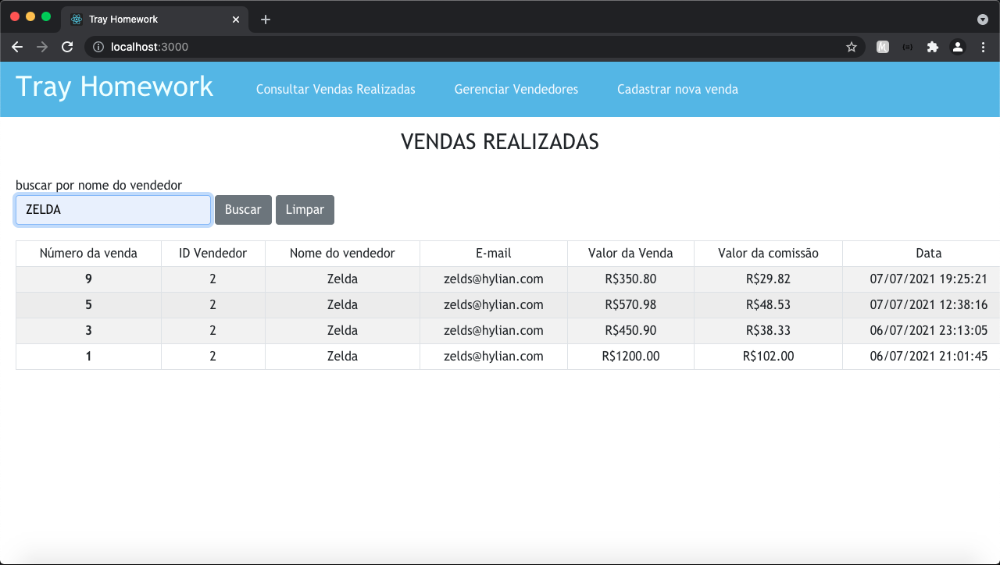
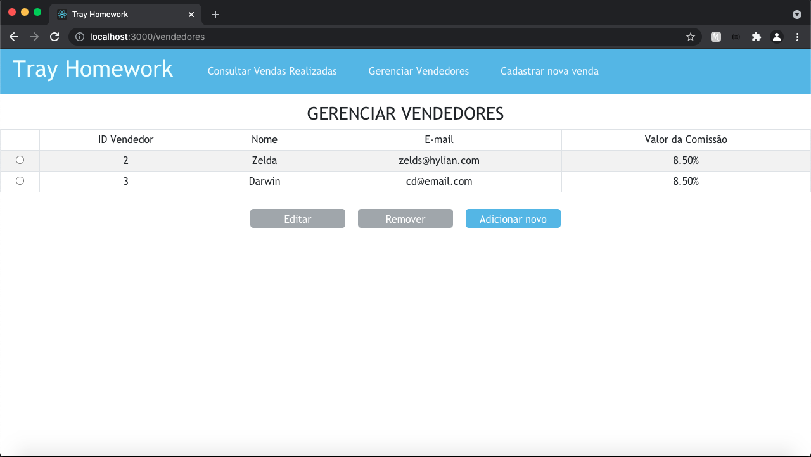
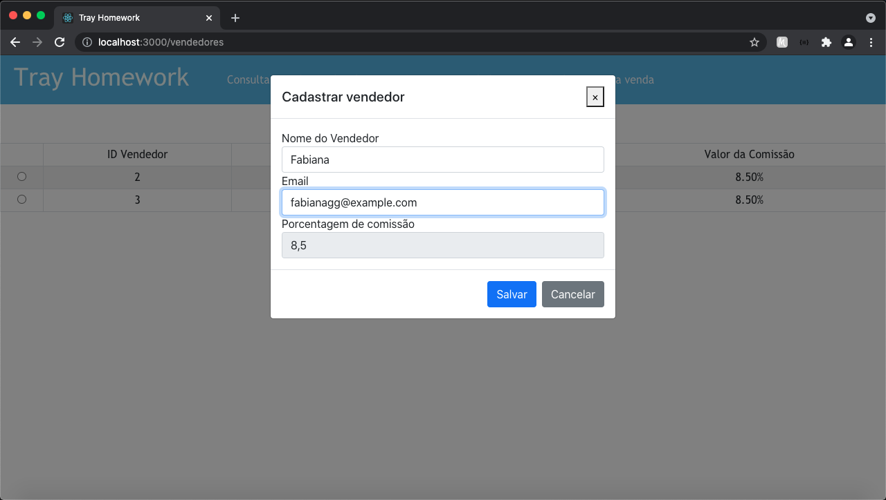
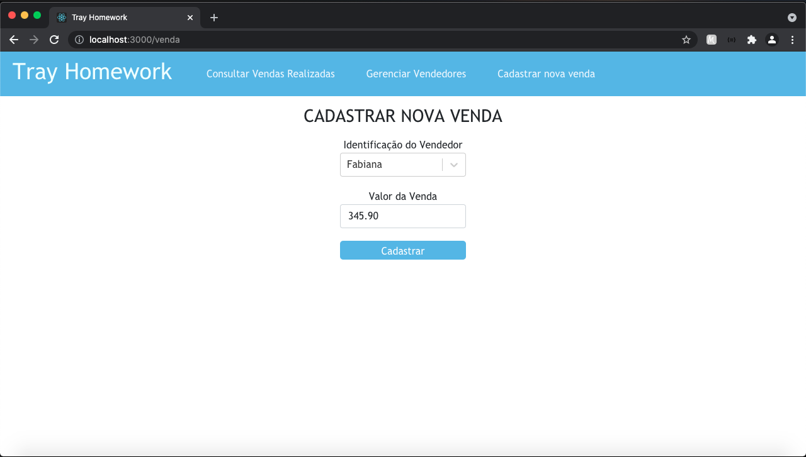

# Sistema de Cadastro de Vendas e Gerenciamento de Vendedores - Frontend

**Frontend de um sistema de cadastro de vendas e gerenciamento de vendedores feito em React.js** 
Neste sistema podemos cadastrar vendas realizadas, passando a informação do vendedor e o valor da venda. 
Podemos, também, cadastrar novos vendedores, editar os já cadastrados ou removê-los. 
E, ainda, temos telas para consultar as vendas realizadas, podendo filtrá-las por vendedor. 

## How to Use
- É necessário ter instalado o [node.js](https://nodejs.org/en/download/);
- Ir na pasta do projeto e executar o comando `npm install`: para instalar as dependências necessárias; 
- E depois, na mesma pasta, o comando `npm start`: inicia a aplicação no caminho "localhost:3000"
 

No arquivo `Backend.js` é possível alterar a url do backend (onde o sistema feito em Laravel estiver rodando como `php artisan serve`), no entanto, por padrão, está utilizando o caminho "localhost:8000/api"
 

*O backend foi feito em PHP com Laravel* e está localizado neste [repositório](https://github.com/fabygiacomini/sales-backend).
 

## Tecnologias utilizadas
- React.js
- Node.js
- React-router
- reactstrap
- React-select
- JSX

## Telas de exemplo
Abaixo temos alguns prints de algumas telas do sistema.
 

### Consultar de Vendas Realizadas
Nesta tela temos a listagem de todas as vendas realizadas. 

Por meio do campo de texto, podemos filtrar as vendas por vendedor, inserindo parte de seu nome. 

 

### Gerenciar de Vendedores
Sob esta opção do menu, podemos consultar todos os vendedores cadastrados no sistema. 
Podemos, além de consultar, selecionar um vendedor para remover, atualizar seus dados, ou cadastrar um novo vendedor. 

Este é um exemplo do modal de criação de novo vendedor ou de edição de um já existente:

### Cadastrar nova venda
Aqui podemos cadastrar uma nova venda, selecionando o vendedor dentre as opções de vendedores cadastrados e inserindo o o valor da venda. 
O backend, ao inserir a venda, já calcula o valor da comissão do vendedor com base em sua taxa de comissão cadastrada (atualmente a taxa está fixa em 8.5%, mas o sistema já foi feito para permitir a liberação deste campo no momento do cadastro do vendedor - basta remover as propriedades `readOnly` e `disable` do componente `Input` (`name:"commission-fee"`) referente à comissão, e passar a enviar na requisição a variável `sellerCommissionFee`) ao invés do valor fixo. 

